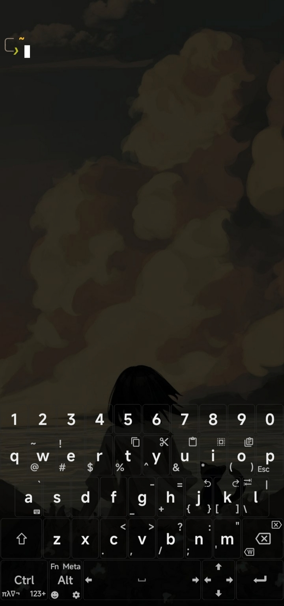

<h1 align="center">Gatin' Dotfiles</h1>

<p align="center">Personal Termux setup</p>

> [!WARNING]
> Personal repo. Use at your own risk, no support.

## Stack

- **Platform:** [Termux](https://termux.dev/)
- **Shell:** [Fish](https://fishshell.com/)
- **Prompt:** [Starship](https://starship.rs/)
- **Editor:** [Neovim](https://neovim.io/) + [LazyVim](https://www.lazyvim.org/)
- **Colorscheme:** [Gruvbox](https://github.com/morhetz/gruvbox)
- **Font:** [Maple Mono Nerd Font](https://font.subf.dev/)

## Preview



## Install deps

```bash
pkg install -y \
  clang \
  nodejs \
  neovim \
  eza \
  bat \
  fish \
  starship \
  zoxide \
  git -y
```

## Unexpected Keyboard Layout
```xml
<?xml version="1.0" encoding="UTF-8" standalone="yes"?>
<keyboard bottom_row="false" name="QWERTY" script="none">
  <row>
    <key key0="q" key2="1"/>
    <key key0="w" key1="~" key2="2" key3="\@"/>
    <key key0="e" key1="!" key2="3" key3="\#" key4="loc €"/>
    <key key0="r" key1="loc ₪" key2="4" key3="$"/>
    <key key0="t" key2="copy" key3="%"/>
    <key key0="y" key2="cut" key3="^"/>
    <key key0="u" key2="paste" key3="&amp;"/>
    <key key0="i" key2="selectAll" key3="*"/>
    <key key0="o" key1="loc accent_macron" key2="switch_clipboard" key3="(" key4=")"/>
    <key key0="p" key2="0" key3="esc" key4="f12_placeholder"/>
  </row>
  <row>
    <key shift="0.5" key0="a" key2="`"/>
    <key key0="s"/>
    <key key0="d"/>
    <key key0="f"/>
    <key key0="g" key1="loc accent_caron" key2="-" key3="_"/>
    <key key0="h" key2="=" key3="+"/>
    <key key0="j" key1="loc accent_trema" key2="undo" key3="{" key4="}"/>
    <key key0="k" key1="loc accent_double_aigu" key2="redo" key3="[" key4="]"/>
    <key key0="l" key1="tab" key2="|" key3="\\"/>
  </row>
  <row>
    <key width="1.5" key0="shift" key2="loc capslock"/>
    <key key0="z"/>
    <key key0="x"/>
    <key key0="c" key2="&lt;" key3="."/>
    <key key0="v" key2=">" key3=","/>
    <key key0="b" key2="\?" key3="/"/>
    <key key0="n" key1="loc accent_tilde" key2=":" key3=";"/>
    <key key0="m" key2="&quot;" key3="'"/>
    <key width="1.5" key0="backspace" key2="delete"/>
  </row>
  <row>
    <key width="1.7" key0="ctrl" key3="switch_greekmath" key4="switch_numeric"/>
    <key width="1.2" key0="alt" key1="fn" key2="meta" key3="switch_emoji" key4="config"/>
    <key width="4.2" key0="space" key5="cursor_left" key6="cursor_right"/>
    <key width="1.2" key5="cursor_left" key6="cursor_right" key7="up" key8="down"/>
    <key width="1.7" key0="enter"/>
  </row>
</keyboard>
```